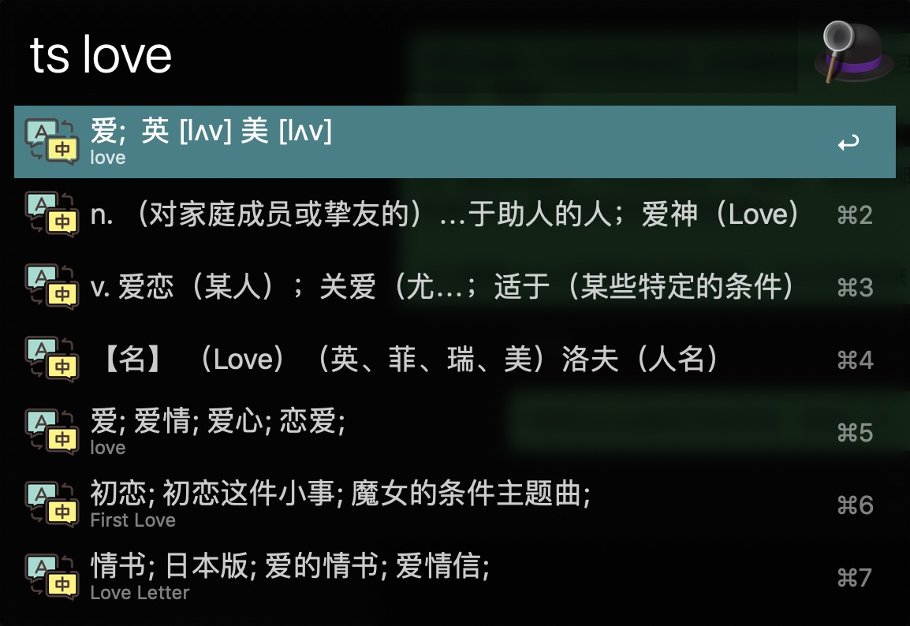
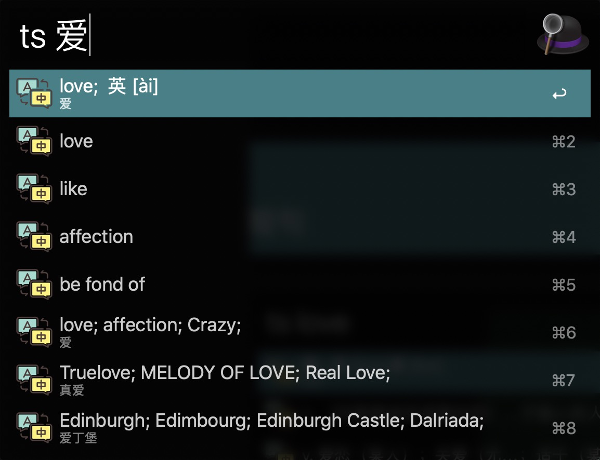
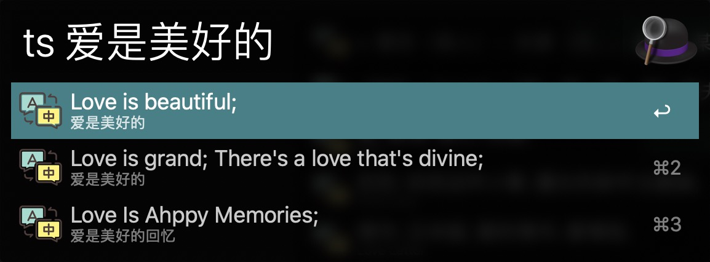
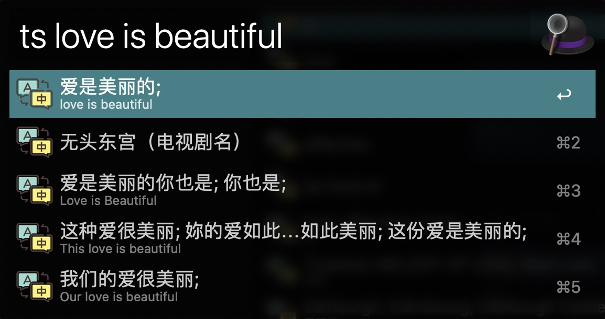

# Alfred 上的翻译插件
- 触发后的效果

  
- 单词英译中

- 单词中译英  

- 短句中译英

- 短句英译中

  

## 如何使用
> 1.0版本暂时只支持有道翻译，后续会继续迭代支持更多平台
### 1. 配置有道 KEYS

由于有道翻译 api 迁移到了有道智云，所以需要去有道智云进行注册然后创建应用。

步骤如下:

1.注册有道智云帐号

  https://ai.youdao.com/

2. 创建一个自然语言翻译服务

  https://ai.youdao.com/fanyi-services.s

3. 创建一个应用并绑定第二步创建的服务

  https://ai.youdao.com/appmgr.s

4. 这样就可以获得应用(appKey)和密钥(secret)了

  应用详情 - 应用ID appKey, 应用密钥 secret

5. 把变量填入 workflow 右上角的 [X] 点开后的配置框中

### 2. 快捷键
在Alfred中输入关键字 ts

-----

> 后续会参考接入google翻译、百度翻译等多平台支持

## 参考项目
[shanbay-alfred2](https://github.com/alswl/shanbay-alfred2)